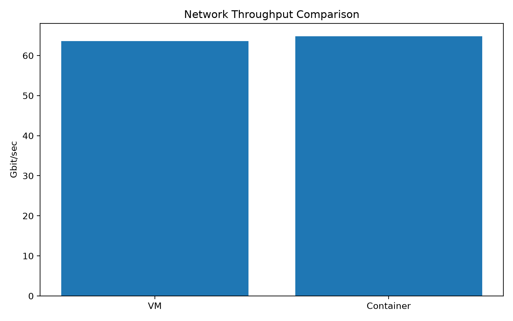

# Experiment 2 — Performance Analysis of Virtual Machines and Containers

## 1. Aim

To compare the performance of a Virtual Machine (VM) and a Docker container by evaluating CPU, memory, disk I/O, network performance, and application-level execution under a controlled experimental environment.

---

## 2. Objectives

- Understand the difference between Virtual Machine and container-based virtualization.
- Configure and verify the Virtual Machine environment.
- Configure and verify the Docker container environment.
- Measure CPU performance using benchmarking tools.
- Compare memory and disk I/O performance.
- Measure and compare network performance.
- Run a containerized FastAPI application and verify application-level execution.
- Analyze the collected results and observations.

---

# 3. Experiment Overview

Virtual Machines and containers are two commonly used approaches for virtualization in cloud computing.

A **Virtual Machine** runs a complete guest operating system on virtualized hardware managed by a hypervisor. This provides strong isolation but requires a separate operating system environment for each VM.

A **Docker container** provides application-level isolation while sharing the host operating system kernel. Containers are generally lightweight and can be created and started quickly.

In this experiment, both environments are evaluated using system-level and application-level performance measurements.

### VM vs Container

| Feature | Virtual Machine | Docker Container |
|---|---|---|
| Virtualization level | Hardware / OS level | Application level |
| Operating system | Complete guest OS | Shares host kernel |
| Isolation | Strong | Process-level isolation |
| Resource overhead | Higher | Lower |
| Startup time | Relatively higher | Relatively lower |
| Management | Hypervisor | Docker |
| Experiment focus | System performance | Container performance |

---

# 4. Experimental Environment

## 4.1 Virtual Machine Configuration

| Parameter | Configuration |
|---|---|
| Platform | VMware Virtual Platform |
| Operating System | Ubuntu 24.04.5 LTS |
| Kernel | 7.0.0-31-generic |
| CPU | 2 virtual CPUs |
| Memory | Approximately 1.9 GiB |
| Virtual Disk | 20 GB |
| Swap | Approximately 3.4 GiB |

## 4.2 Docker Container Configuration

| Parameter | Configuration |
|---|---|
| Container Runtime | Docker 29.1.3 |
| Base Image | Ubuntu 24.04 |
| CPU Limit | 1 CPU |
| Memory Limit | 512 MB |
| Memory cgroup limit | 536870912 bytes |
| CPU cgroup configuration | 100000 / 100000 |

## 4.3 Tools Used

| Tool | Purpose |
|---|---|
| Sysbench | CPU benchmarking |
| fio | Disk I/O benchmarking |
| iperf3 | Network performance measurement |
| Docker | Container creation and management |
| FastAPI | Application-level testing |
| Python | Data processing and graph generation |

---

# 5. Experiment Architecture

## 5.1 VM vs Container Architecture

```text
                    VM vs Container
                          |
             +------------+------------+
             |                         |
       Virtual Machine           Docker Container
             |                         |
        Ubuntu OS                 Ubuntu Image
             |                         |
      +------+------+          +------+------+
      |      |      |          |      |      |
     CPU   Memory  Disk        CPU   Memory  Disk
      |      |      |          |      |      |
      +------+------+          +------+------+
             |                         |
             +------------+------------+
                          |
                    Network Testing
                          |
                        iperf3
                          |
                 Performance Results
````

## 5.2 FastAPI Application Architecture

```text
              Client
                 |
                 v
       Containerized FastAPI
                 |
          +------+------+
          |             |
          v             v
      Health API    Compute API
          |             |
          v             v
     Health Status   Computation
       Response        Result
```

---

# 6. Experiment Workflow

```text
System Setup
     |
     v
VM Configuration
     |
     v
Docker Configuration
     |
     v
Container Creation
     |
     v
CPU Benchmark
     |
     v
Memory Benchmark
     |
     v
Disk I/O Benchmark
     |
     v
Network Benchmark
     |
     v
FastAPI Application Test
     |
     v
Result Collection
     |
     v
Performance Analysis
     |
     v
Conclusion
```

---

# 7. Experimental Procedure

## Step 1 — Verify VM Environment

The VM environment was first verified using Linux system-information commands.

The following were checked:

* CPU configuration
* Memory
* Storage
* Operating system
* Kernel
* Virtualization platform

The corresponding evidence is available in the `screenshots/` directory.

---

## Step 2 — Verify Docker Environment

Docker installation and configuration were verified before performing the container experiments.

The following were checked:

* Docker installation
* Docker version
* Container configuration
* Resource limits
* Required benchmarking tools

---

## Step 3 — Create and Verify Container

A Docker container was created using the configured Ubuntu-based environment.

The container was verified to ensure that:

* The container starts successfully.
* Required tools are available.
* Resource limits are applied.
* Benchmarking commands can be executed.

---

## Step 4 — CPU Performance Test

CPU performance was evaluated using **Sysbench**.

The benchmark was performed for the VM and container environments and the resulting measurements were collected for comparison.

---

## Step 5 — Memory Performance Test

Memory performance was evaluated using the configured container environment.

The container was restricted to **512 MB memory** to demonstrate controlled resource allocation using Docker and cgroups.

---

## Step 6 — Disk I/O Performance Test

Disk performance was evaluated using **fio**.

The following operations were tested:

* Sequential Read
* Sequential Write
* Random Read
* Random Write

The VM and container disk results were collected for comparison.

---

## Step 7 — Network Performance Test

Network performance was evaluated using **iperf3**.

The VM and container network environments were tested separately and their measured throughput values were recorded.

The measured network throughput was approximately:

| Environment      | Network Throughput |
| ---------------- | -----------------: |
| Virtual Machine  |   **64–66 Gbit/s** |
| Docker Container |    **64.8 Gbit/s** |

---

## Step 8 — FastAPI Application Test

A FastAPI application was used for application-level testing inside the container.

The application provides endpoints for:

* Health checking
* Computation

The following were verified:

1. FastAPI container is running.
2. Health endpoint responds successfully.
3. Compute endpoint executes successfully.
4. Containerized application can be accessed through its exposed endpoints.

---

# 8. Benchmark Categories

The experiment evaluates the following performance parameters:

| Category    | Tool / Method    |
| ----------- | ---------------- |
| CPU         | Sysbench         |
| Memory      | Memory benchmark |
| Disk I/O    | fio              |
| Network     | iperf3           |
| Application | FastAPI          |

---

# 9. Performance Results

The experiment evaluates the following performance areas:

## 9.1 CPU Performance

CPU performance was measured using **Sysbench** for both the VM and Docker container environments.

The corresponding benchmark evidence is available in:

```text
screenshots/11-vm-cpu-result.png
screenshots/12-container-cpu-result.png
```

The processed benchmark data is available in:

```text
results/processed/benchmark_results.csv
```

---

## 9.2 Memory Performance

Memory performance was evaluated using the configured container environment.

The container was restricted to:

```text
512 MB
```

The corresponding result is available in:

```text
screenshots/13-container-memory-result.png
```

---

## 9.3 Disk I/O Performance

Disk performance was evaluated using **fio**.

The following operations were tested:

* Sequential Read
* Sequential Write
* Random Read
* Random Write

The corresponding results are available in:

```text
screenshots/14-vm-disk-results.png
screenshots/15-container-disk-results.png
```

---

## 9.4 Network Performance

Network performance was measured using **iperf3**.

| Environment      | Measured Throughput |
| ---------------- | ------------------: |
| Virtual Machine  |    **64–66 Gbit/s** |
| Docker Container |     **64.8 Gbit/s** |

The corresponding evidence is available in:

```text
screenshots/16-vm-network-iperf3.png
screenshots/17-container-network-iperf3.png
```

---

## 9.5 Application-Level Performance

A FastAPI application was deployed inside the Docker environment.

The following application operations were tested:

| Test             | Purpose                                |
| ---------------- | -------------------------------------- |
| Health Endpoint  | Verify service availability            |
| Compute Endpoint | Verify application computation         |
| Container Status | Verify application container execution |
| API Endpoints    | Verify application accessibility       |

The corresponding evidence is available in:

```text
screenshots/18-fastapi-health.png
screenshots/19-fastapi-compute.png
screenshots/20-fastapi-container-running.png
screenshots/21-container-fastapi-endpoints.png
```

---

# 10. Performance Graphs

The experiment includes generated performance graphs for the measured parameters.

## 10.1 CPU Comparison


---

## 10.2 Network Comparison



---

## 10.3 Container Memory Performance


---

## 10.4 Processed Benchmark Data

The processed benchmark data is available at:

```text
results/processed/benchmark_results.csv
```

## 10.5 Graph Generation Script

The Python script used for graph generation is available at:

```text
results/processed/generate_graphs.py
```

---

# 11. VM and Container Performance Comparison

| Aspect                 | Virtual Machine         | Docker Container                    |
| ---------------------- | ----------------------- | ----------------------------------- |
| Isolation              | Complete guest OS       | Application/process isolation       |
| Kernel                 | Own guest kernel        | Shares host kernel                  |
| Resource overhead      | Higher                  | Lower                               |
| Startup                | Relatively slower       | Relatively faster                   |
| Resource control       | VM allocation           | Docker limits / cgroups             |
| Application deployment | Complete OS environment | Lightweight application environment |
| CPU Testing            | Sysbench                | Sysbench                            |
| Disk Testing           | fio                     | fio                                 |
| Network Testing        | iperf3                  | iperf3                              |
| Application Testing    | FastAPI                 | Containerized FastAPI               |

---

# 12. Observations

The following observations were made during the experiment:

1. Both VMs and containers provide isolated execution environments.

2. A VM provides a complete guest operating system environment.

3. Containers share the host operating system kernel.

4. Docker allows CPU and memory resources to be controlled.

5. CPU performance can be evaluated using Sysbench.

6. Disk I/O performance can be evaluated using fio.

7. Network throughput can be measured using iperf3.

8. The measured network performance of the VM was approximately **64–66 Gbit/s**, while the container achieved approximately **64.8 Gbit/s**.

9. Containerized applications can be deployed and accessed through application endpoints.

10. The collected benchmark results provide a practical basis for comparing VM and container execution.

---

# 13. Experimental Evidence

All experimental screenshots are stored under:

```text
screenshots/
```

## 13.1 System and Configuration

```text
01-docker-hello-world.png
02-lscpu-system-info - Copy.png
03-memory-and-storage-info - Copy.png
04-disk-and-docker-info.png
05-vm-configuration.png
06-docker-configuration.png
```

## 13.2 Benchmark Setup

```text
07-baseline-cpu-sysbench.png
08-benchmark-dockerfile.png
09-benchmark-docker-image - Copy.png
10-container-tools-verification - Copy.png
```

## 13.3 CPU and Memory

```text
11-vm-cpu-result.png
12-container-cpu-result.png
13-container-memory-result.png
```

## 13.4 Disk

```text
14-vm-disk-results.png
15-container-disk-results.png
```

## 13.5 Network

```text
16-vm-network-iperf3.png
17-container-network-iperf3.png
```

## 13.6 FastAPI Application

```text
18-fastapi-health.png
19-fastapi-compute.png
20-fastapi-container-running.png
21-container-fastapi-endpoints.png
```

---

# 14. Repository Structure

```text
Experiment 2 — VM vs Container Performance Analysis/
│
├── README.md
│
├── api/
│   ├── Dockerfile
│   ├── main.py
│   └── requirements.txt
│
├── docker/
│   └── Dockerfile
│
├── docs/
│   ├── cpu-info.txt
│   ├── kernel-info.txt
│   ├── memory-info.txt
│   └── storage-info.txt
│
├── results/
│   ├── figures/
│   │   ├── 01-cpu-comparison.png
│   │   ├── 02-network-comparison.png
│   │   └── 03-container-memory-performance.png
│   │
│   └── processed/
│       ├── benchmark_results.csv
│       └── generate_graphs.py
│
└── screenshots/
    ├── 01-docker-hello-world.png
    ├── 02-lscpu-system-info - Copy.png
    ├── 03-memory-and-storage-info - Copy.png
    ├── 04-disk-and-docker-info.png
    ├── 05-vm-configuration.png
    ├── 06-docker-configuration.png
    ├── 07-baseline-cpu-sysbench.png
    ├── 08-benchmark-dockerfile.png
    ├── 09-benchmark-docker-image - Copy.png
    ├── 10-container-tools-verification - Copy.png
    ├── 11-vm-cpu-result.png
    ├── 12-container-cpu-result.png
    ├── 13-container-memory-result.png
    ├── 14-vm-disk-results.png
    ├── 15-container-disk-results.png
    ├── 16-vm-network-iperf3.png
    ├── 17-container-network-iperf3.png
    ├── 18-fastapi-health.png
    ├── 19-fastapi-compute.png
    ├── 20-fastapi-container-running.png
    └── 21-container-fastapi-endpoints.png
```

---

# 15. Conclusion

This experiment successfully compares Virtual Machine and Docker container environments using system-level and application-level performance measurements.

CPU performance was evaluated using **Sysbench**, disk I/O using **fio**, and network performance using **iperf3**. Docker resource limits were also used to demonstrate controlled container resource allocation.

The network performance measurements showed approximately **64–66 Gbit/s** for the Virtual Machine and approximately **64.8 Gbit/s** for the Docker container.

In addition, a FastAPI application was deployed inside a Docker container and tested through its application endpoints.

Overall, the experiment provides practical understanding of how VMs and containers differ in terms of virtualization approach, resource management, performance measurement, and application deployment.

---

# 16. Key Learning Outcomes

After completing this experiment, we understand:

* The difference between Virtual Machines and containers.
* How a VM is configured and verified.
* How Docker containers are created and managed.
* How CPU performance can be benchmarked using Sysbench.
* How memory limits can be applied to containers.
* How disk I/O can be measured using fio.
* How network throughput can be measured using iperf3.
* How application services can be deployed inside containers.
* How benchmark results can be collected, processed, and visualized.
* How VM and container performance can be compared experimentally.

---

# 17. Final Deliverables

This experiment contains:

* VM configuration evidence
* Docker configuration evidence
* Container setup and verification
* CPU benchmark results
* Memory performance results
* Disk I/O results
* Network performance results
* FastAPI application testing
* Experimental screenshots
* Processed benchmark data
* Performance graphs
* Performance observations
* Final conclusion

---

## Course Information
**Name:** Bhavana

**Course:** Cloud Computing

**Experiment:** 2 — Performance Analysis of Virtual Machines and Containers

**Academic Year:** 2026–27

